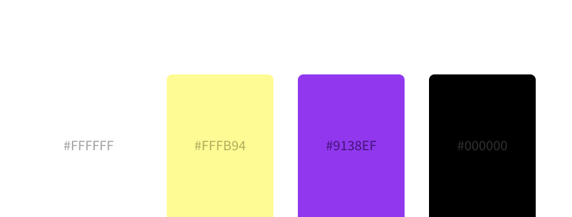
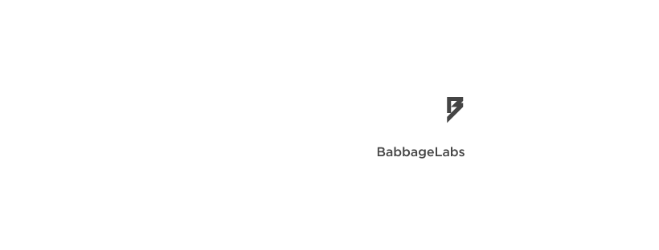
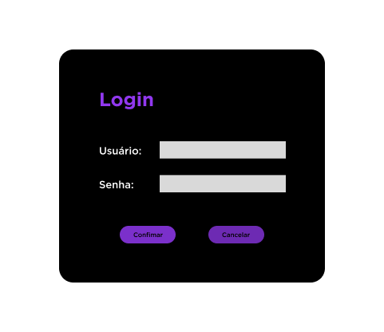
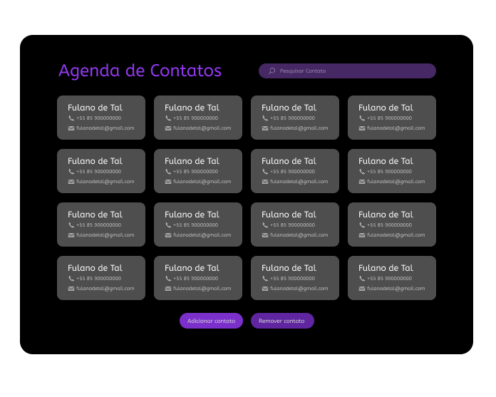
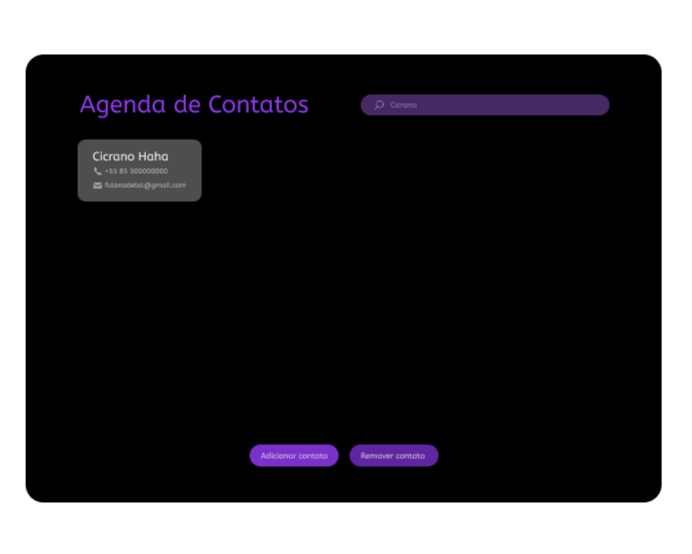
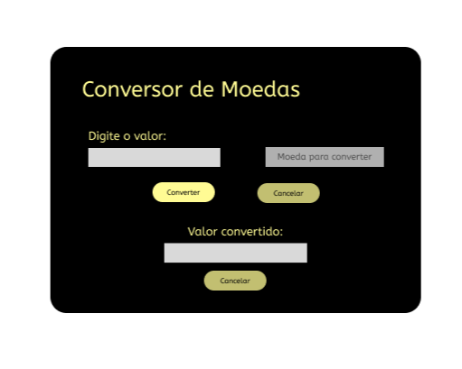

# 🎨 Design

Esta pasta reúne **todos os arquivos relacionados ao design, identidade visual e interfaces** do projeto.  
Aqui você encontra os elementos fundamentais para manter a **consistência visual** em todos os módulos e telas.

---

## 👾 Identidade Visual

### • Logo

  

### • Paleta de Cores

  

### • Tipografia

  

---

## 🖥️ Interfaces do Projeto

A seguir, estão listadas as principais telas desenvolvidas, organizadas por módulo:

---

## 1. Login + Tela Inicial

  

  

---

## 2. Agenda de Contatos

### • Tela Principal

  

### • Pesquisa

  

### • Edição / Salvamento

  

  

---

## 3. Conversor de Moedas

  

---
